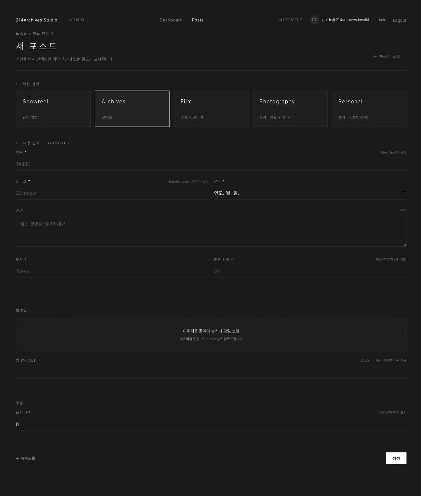

# Archives — 여행·도시 사진 묶음

## 개요

| 필수 | 선택 | 갤러리 |
|---|---|---|
| 제목·URL 주소·날짜·썸네일·**도시**·**연도 라벨** | 설명 | 있음 (사진) |

Archives는 도시별 여행·촬영 사진을 묶어 소개하는 섹션입니다.

## 화면

### A. 공통 필드

제목·URL 주소·날짜·설명·썸네일 — [공통 A — 새 게시물 만들기](../common/0-create)와 동일합니다.

### B. 도시·연도 라벨

도시명과, 제목 옆에 붙는 연도 표기(예 `'25`)입니다.

## 등록

*(예: 도쿄 2025)*

1. [공통 A — 새 게시물 만들기](../common/0-create)에서 **Archives** 선택 · 제목은 대문자 도시명 권장 (`TOKYO`) · URL 주소 예 `25-tokyo`
2. **도시** `Tokyo` · **연도 라벨** `'25` (제목 옆에 붙는 표기)
3. 썸네일 업로드 → **생성**
4. 편집 화면에서 [공통 B — 갤러리](../common/1-gallery)로 사진 여러 장 업로드 → 드래그로 순서 정리 → alt 입력
5. 공개 상태 **공개** → [공통 E — 게시](../common/4-publish)

## 수정·삭제

**수정**: [공통 C — 수정하기](../common/2-edit) (사진 추가·교체는 [공통 B — 갤러리](../common/1-gallery))
**삭제**: [공통 F — 삭제하기](../common/5-delete)
