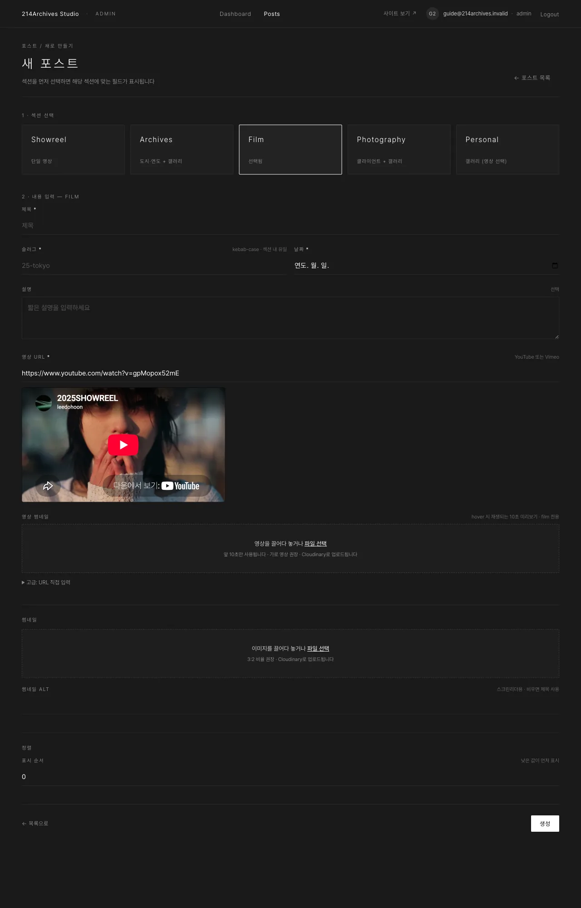
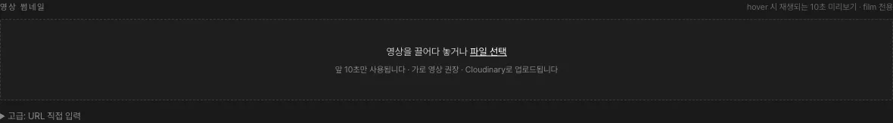

# Film — 영상 작업 (hover 미리보기 포함)

## 개요

| 필수 | 선택 | 갤러리 |
|---|---|---|
| 제목·슬러그·날짜·썸네일·**영상 URL** | 설명·**영상 썸네일** | 있음 (사진) |

Film은 영상 작업을 소개하는 섹션으로, 카드에 마우스를 올리면 짧은 영상이 재생되는 영상 썸네일을 지원합니다.

## 화면

### A. 공통 필드

제목·슬러그·날짜·설명·썸네일 — [공통 A — 새 게시물 만들기](../common/0-create)와 동일합니다.

### B. 영상 URL

본편(YouTube/Vimeo) 주소입니다. 입력하면 미리보기가 표시됩니다.

### C. 영상 썸네일

카드에 마우스를 올리면 재생되는 짧은 영상입니다. mp4/webm/mov 파일(200MB 이하)을 올리면 앞 10초만 자동으로 잘라 사용합니다.

## 등록

1. [공통 A — 새 게시물 만들기](../common/0-create)에서 **Film** 선택 · 슬러그 예 `09-title`
2. **영상 URL** — 본편(YouTube/Vimeo) 주소 → 미리보기 확인
3. **영상 썸네일** — 카드에 마우스를 올리면 재생되는 짧은 영상. "영상을 끌어다 놓거나 파일 선택" → mp4/webm/mov (가로 영상 권장, 200MB 이하). 앞 **10초만** 자동으로 잘라 쓰므로 긴 파일을 그대로 올려도 됨. 업로드 직후 폼 안에서 자동 재생되면 성공 (5~10초 걸릴 수 있음)
   - 이미 Cloudinary URL이 있으면 **고급: URL 직접 입력**에 붙여넣기
4. 썸네일(정지 이미지) 업로드 → **생성**
5. 필요하면 [공통 B — 갤러리](../common/1-gallery)로 스틸컷 갤러리 추가
6. 공개 상태 **공개** → [공통 E — 게시](../common/4-publish) → 사이트 `/film`에서 카드 hover 재생 확인

## 수정·삭제

**수정**: [공통 C — 수정하기](../common/2-edit) — 영상 썸네일만 바꾸려면 **영상 변경** 버튼 → 새 파일 → 저장
**삭제**: [공통 F — 삭제하기](../common/5-delete)
