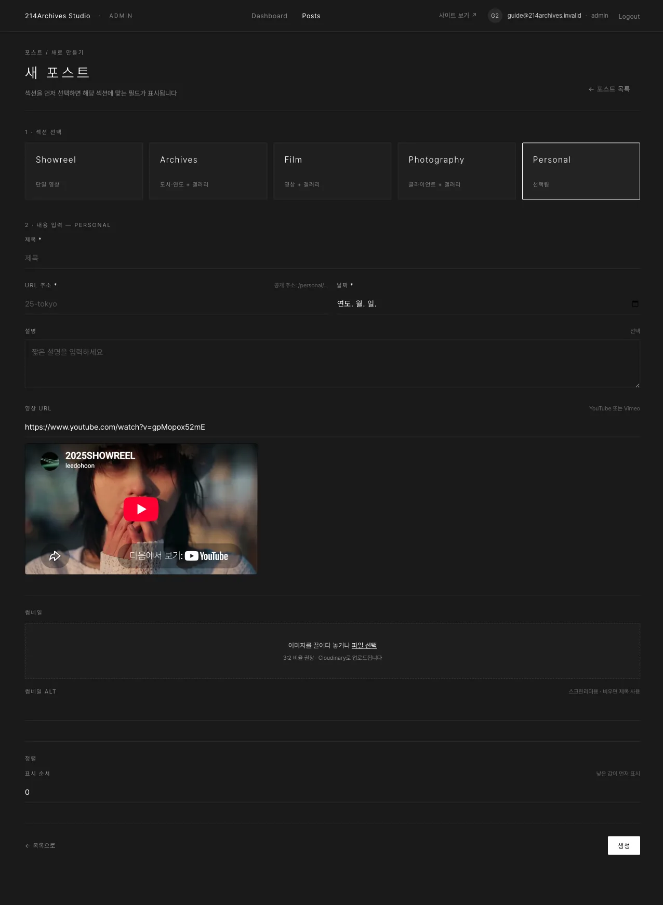
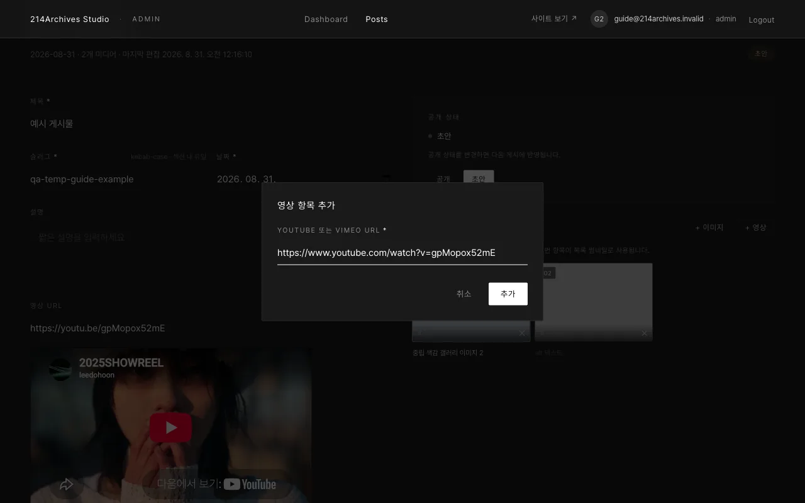

# Personal — 개인 작업 (사진 + 영상 카드)

## 개요

| 필수 | 선택 | 갤러리 |
|---|---|---|
| 제목·슬러그·날짜·썸네일 | 설명·영상 URL | 있음 (**사진 + 영상 카드**) |

Personal은 개인 작업을 소개하는 섹션으로, 사진과 영상 카드를 함께 갤러리에 넣을 수 있습니다.

## 화면

### A. 공통 필드

제목·슬러그·날짜·설명·썸네일 — [공통 A — 새 게시물 만들기](../common/0-create)와 동일합니다.

### B. 영상 URL (선택)

비워 둘 수 있습니다. 영상을 갤러리 카드로 넣는 방법은 아래 "영상 카드 넣기"를 참고하세요.

## 등록

1. [공통 A — 새 게시물 만들기](../common/0-create)에서 **Personal** 선택 (영상 URL은 비워도 됨)
2. 썸네일 업로드 → **생성**
3. [공통 B — 갤러리](../common/1-gallery)로 사진 업로드
4. 영상을 갤러리 카드로 넣으려면 **미디어 → + 영상** → YouTube/Vimeo 주소 → **추가** (YouTube는 카드에 썸네일이 표시됨). 영상 카드도 드래그로 순서 변경·✕로 삭제
5. 공개 상태 **공개** → [공통 E — 게시](../common/4-publish)

## 영상 카드 넣기

**미디어 → + 영상**을 누르면 YouTube/Vimeo 주소를 입력하는 모달이 열립니다. **추가**를 누르면 카드가 갤러리에 추가되며(YouTube는 카드에 썸네일이 표시됨), 사진 카드와 마찬가지로 드래그로 순서 변경·✕로 삭제할 수 있습니다.

## 수정·삭제

**수정**: [공통 C — 수정하기](../common/2-edit) · **삭제**: [공통 F — 삭제하기](../common/5-delete)

::: info 참고
Personal 외 섹션에는 "+ 영상" 버튼이 없습니다. Film·Showreel의 영상은 폼의 "영상 URL"로 넣습니다.
:::
