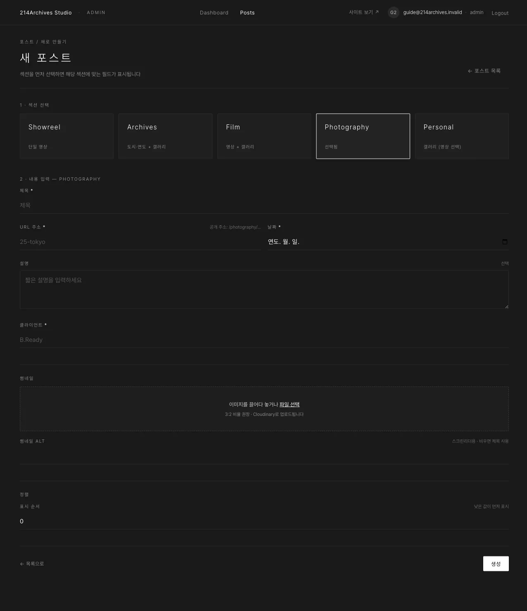

# Photography — 클라이언트 촬영

## 개요

| 필수 | 선택 | 갤러리 |
|---|---|---|
| 제목·URL 주소·날짜·썸네일·**클라이언트** | 설명 | 있음 (사진) |

Photography는 클라이언트 촬영 결과물을 소개하는 섹션입니다.

## 화면

### A. 공통 필드

제목·URL 주소·날짜·설명·썸네일 — [공통 A — 새 게시물 만들기](../common/0-create)와 동일합니다.

### B. 클라이언트

촬영을 의뢰한 클라이언트명입니다 (예 `B.Ready`).

## 등록

1. [공통 A — 새 게시물 만들기](../common/0-create)에서 **Photography** 선택
2. **클라이언트** 이름 입력 (예 `B.Ready`)
3. 썸네일 업로드 → **생성**
4. [공통 B — 갤러리](../common/1-gallery)로 사진 업로드 → 순서·alt
5. 공개 상태 **공개** → [공통 E — 게시](../common/4-publish)

## 수정·삭제

**수정**: [공통 C — 수정하기](../common/2-edit) · **삭제**: [공통 F — 삭제하기](../common/5-delete)
