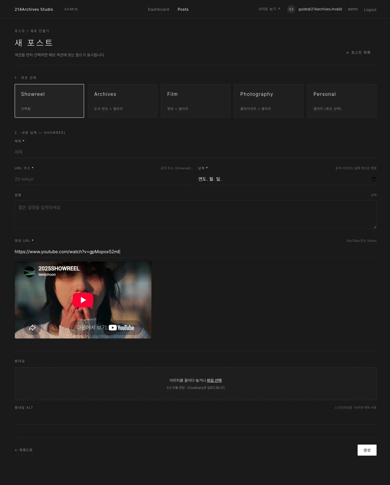

# Showreel — 대표 영상 1개

## 개요

| 필수 | 선택 | 갤러리 |
|---|---|---|
| 제목·슬러그·날짜·썸네일·**영상 URL** | 설명 | **없음** (영상 하나만) |

Showreel은 대표 영상 1개만 소개하는 섹션으로, 갤러리 없이 영상 URL과 썸네일만으로 구성됩니다.

## 화면

### A. 공통 필드

제목·슬러그·날짜·설명·썸네일 — [공통 A — 새 게시물 만들기](../common/0-create)와 동일합니다.

### B. 영상 URL

YouTube 또는 Vimeo 주소를 입력하면 아래에 플레이어 미리보기가 표시됩니다.

## 등록

1. [공통 A — 새 게시물 만들기](../common/0-create)에서 섹션 **Showreel** 선택
2. **영상 URL**에 YouTube 또는 Vimeo 주소 붙여넣기 → 바로 아래 플레이어 미리보기가 뜨면 정상 (안 뜨면 주소 오류)
3. 썸네일 업로드 → **생성**
4. 공개 상태 **공개** → [공통 E — 게시](../common/4-publish)

## 수정·삭제

**수정**: [공통 C — 수정하기](../common/2-edit) — 영상을 바꾸려면 영상 URL만 교체 → 저장 → [공통 E — 게시](../common/4-publish)
**삭제**: [공통 F — 삭제하기](../common/5-delete)

::: tip 팁
Showreel은 보통 1개만 운영합니다. 새 쇼릴로 교체할 땐 기존 게시물의 영상 URL·썸네일을 바꾸는 게 가장 간단합니다.
:::
