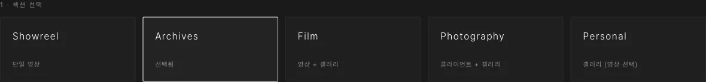
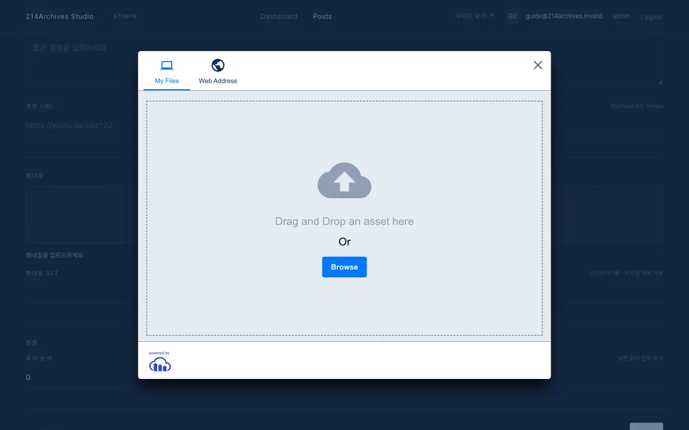
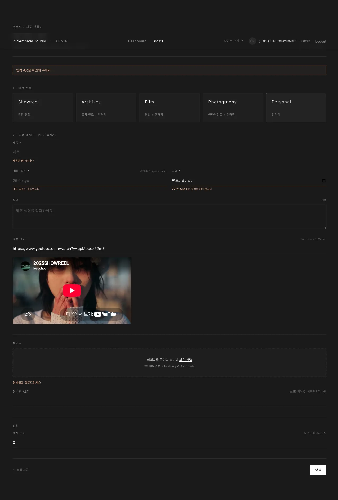

# 새 게시물 만들기

## 개요

새 게시물은 `Posts` 목록에서 시작해 섹션을 고르고 기본 정보와 썸네일을 채운 뒤 생성합니다. 카테고리별 전용 필드는 [카테고리별 등록 → Showreel](../category/showreel) 등 각 페이지를 참고하세요.

## 절차

1. `Posts` → 오른쪽 위 **+ 새 포스트**

2. **섹션 카드** 하나 선택 → 그 섹션에 맞는 폼이 아래에 나타남
3. 공통 입력: **제목** · **URL 주소**(날짜를 입력하면 `26-08-31` 같은 기본값이 자동으로 채워지며, 원하면 직접 수정 가능) · **날짜** · 설명(선택)

4. **썸네일** — "이미지를 끌어다 놓거나 파일 선택" → 업로드 위젯에서 이미지 1장 (3:2 권장) · 썸네일 alt(선택)
5. **갤러리**(선택) — `+ 이미지`로 사진을 미리 담아둘 수 있음 (Personal은 `+ 영상`도 가능) · 게시물 생성과 함께 저장되며, 생성 후 편집 화면에서도 추가 가능
6. 맨 아래 **생성** → 편집 화면으로 이동하며 "썸네일·기본 정보가 저장됐어요" 토스트

## 입력을 빠뜨렸을 때

빈 필수값으로 생성을 누르면 위에 "입력 N곳을 확인해 주세요"가 뜨고 첫 번째 문제 칸으로 스크롤됩니다. 고치는 즉시 경고가 사라집니다.

::: warning 주의
URL 주소는 게시물의 공개 페이지 주소가 되며(예: `/archives/25-tokyo`), 영문 소문자·숫자·하이픈만 사용합니다. 날짜를 입력하면 기본값이 자동으로 채워지고, 같은 섹션에 이미 있는 주소면 `-2`, `-3`… 순번이 자동으로 붙습니다. 직접 입력한 값은 입력을 멈추면 "사용 가능 / 이미 사용 중"이 표시됩니다.
:::
