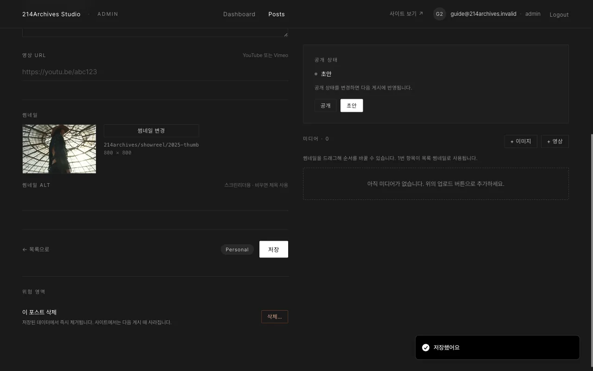

# 수정하기

## 개요

게시물 수정은 `Posts` 목록에서 대상 글을 열어 폼을 고치고 저장하는 순서로 진행합니다. 사진은 저장 없이 즉시 반영되고, 사이트에 실제로 내보내려면 별도로 게시해야 합니다.

## 절차

1. `Posts`에서 게시물 제목 클릭 (또는 **편집**)
2. 왼쪽 폼 수정 → 맨 아래 **저장** → "저장했어요" 토스트
3. 사진 추가·삭제·순서는 [공통 B — 갤러리 사진 넣기·순서·설명](../common/1-gallery) (저장 버튼 없이 즉시 반영)
4. 사이트에 내보내려면 [공통 E — 사이트에 내보내기(게시)](../common/4-publish)

::: warning 주의
저장 전 새로고침. 탭을 닫거나 새로고침하기 전에 **저장**
:::
