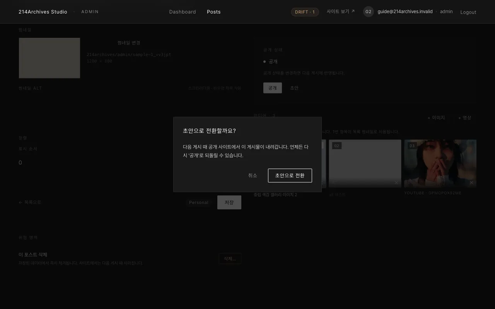

# 공개 / 초안 바꾸기

## 개요

편집 화면 오른쪽 "공개 상태" 카드에서 게시물을 공개 또는 초안으로 전환합니다. 이 표시를 바꾼다고 바로 사이트가 바뀌지는 않으며, 실제 반영은 [공통 E — 사이트에 내보내기(게시)](../common/4-publish)에서 이뤄집니다.

## 화면

오른쪽 **공개 상태** 카드에서 **공개** 또는 **초안**을 선택합니다.

## 절차

- 오른쪽 **공개 상태** 카드 → **공개** 또는 **초안**
- 초안으로 바꿀 땐 "초안으로 전환할까요?" 확인창이 한 번 뜸 (다음 게시 때 사이트에서 내려감)

::: info 참고
새로 만든 게시물은 **초안**으로 시작 → 완성 후 **공개**로 바꿔야 사이트에 나감
:::
