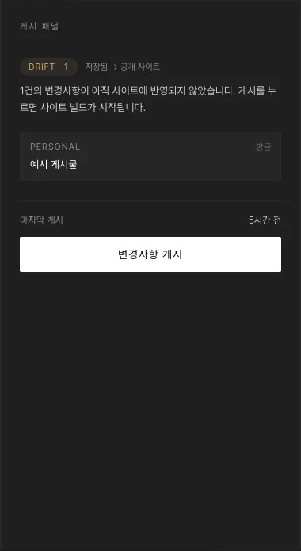

# 사이트에 내보내기(게시)

## 개요

편집 화면에서 저장·공개 상태를 바꾼 변경은 곧바로 사이트에 나가지 않습니다. 대시보드의 **게시 패널**에서 **변경사항 게시**를 눌러야 실제로 배포됩니다.

## 절차

1. 헤더 **DRIFT · N** 배지 클릭 또는 `Dashboard`
2. **게시 패널**에서 무엇이 나갈지 확인 → **변경사항 게시**

3. 약 30초 뒤 패널이 **IN SYNC**로 바뀌고 배지가 사라짐. 최근 활동에 "완료 · 빌드 시작됨 · 1~3분 후 사이트 반영"

4. 1~3분 뒤 사이트에서 확인: `https://www.214archives.com/{섹션}/{슬러그}`

## 진행 확인

게시 패널의 **최근 활동 → 실행 로그 ↗**에서 진행 상황을 볼 수 있고, 1~3분 뒤 사이트 새로고침.

::: warning 주의
게시 패널에 `TIMEOUT`{.error} — 10분 안에 끝나지 않아 자동 실패 처리. 최근 활동 **실행 로그 ↗**로 원인 확인 후 **다시 게시**
:::
