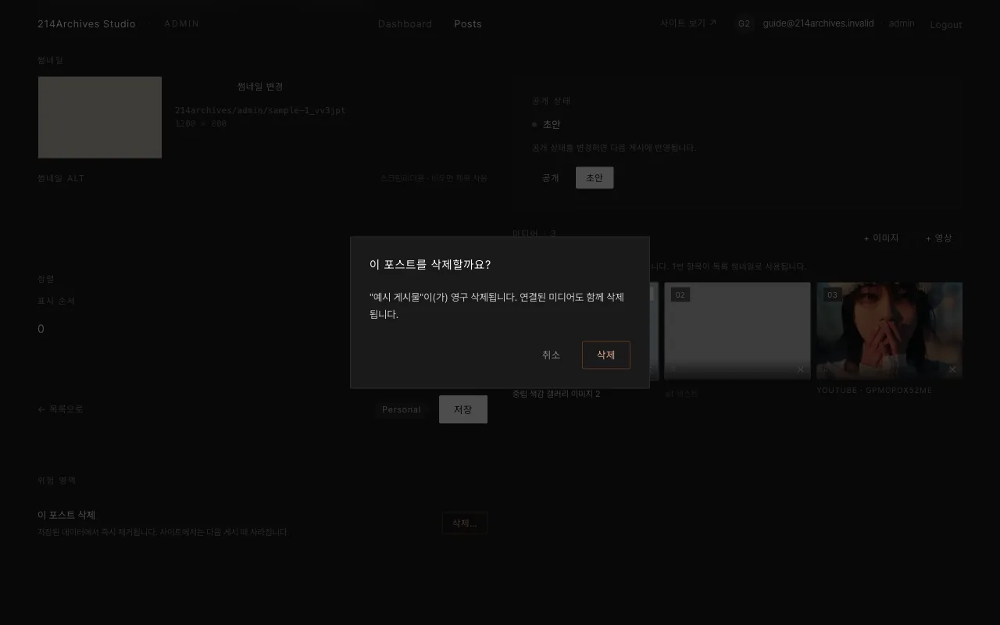

# 삭제하기

## 개요

게시물을 없애는 방법은 두 가지입니다. 사이트에서만 잠깐 내리는 방법과, 게시물 자체를 완전히 지우는 방법입니다.

## 잠깐 내리기

[공통 D — 공개 / 초안 바꾸기](../common/3-visibility)로 **초안** → [공통 E — 사이트에 내보내기(게시)](../common/4-publish) (게시물은 남고 사이트에서만 사라짐)

## 완전히 지우기

편집 화면 맨 아래 **위험 영역 → 삭제…**

→ 확인창 **삭제** → [공통 E — 사이트에 내보내기(게시)](../common/4-publish). (`Posts` 목록의 **삭제** 버튼도 동일)

::: danger 주의
되돌릴 수 없음.
:::
