# 화면 구성

## 개요

어드민 화면 구성: `Dashboard`(게시 패널·최근 활동) · `Posts`(목록·검색·섹션 탭·**+ 새 포스트**) · 편집 화면(왼쪽 폼 / 오른쪽 공개 상태·미디어 / 맨 아래 위험 영역).

## 대시보드

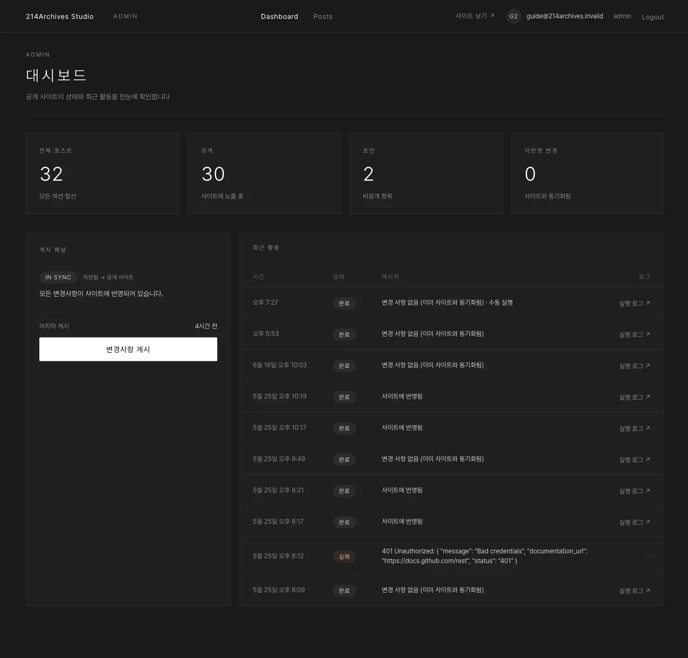

### A. 헤더

헤더 오른쪽 **DRIFT · N** 배지 = 아직 사이트에 안 나간 변경 개수.

### B. 게시 패널

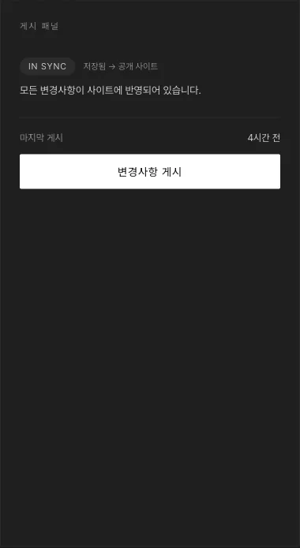

그동안 만들고·고치고·공개/초안 바꾼 **모든 변경을 한 번에** 사이트로 내보내는 버튼입니다. 자세한 절차는 [공통 E — 사이트에 내보내기(게시)](../common/4-publish) 참고.

### C. 최근 활동

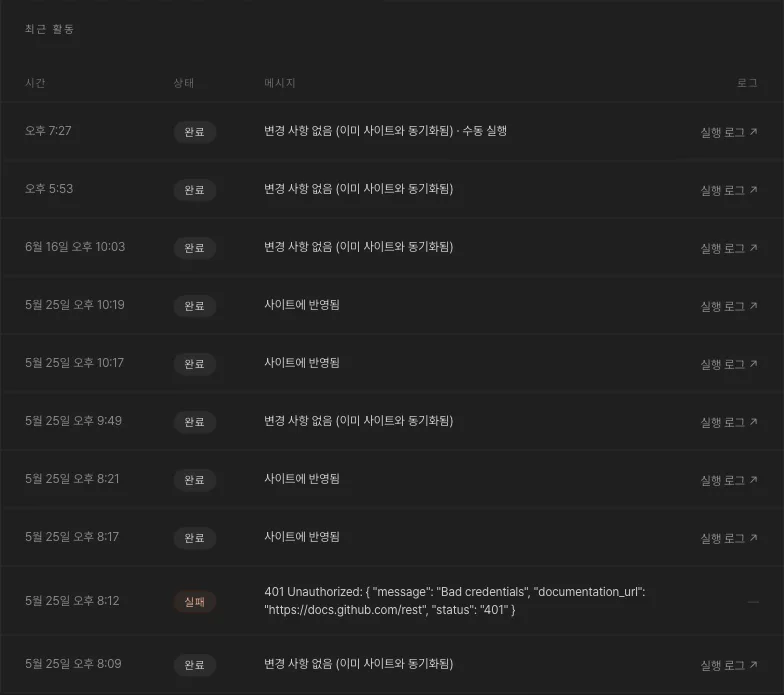

게시 진행 상황을 확인할 수 있습니다.

## 게시물 목록

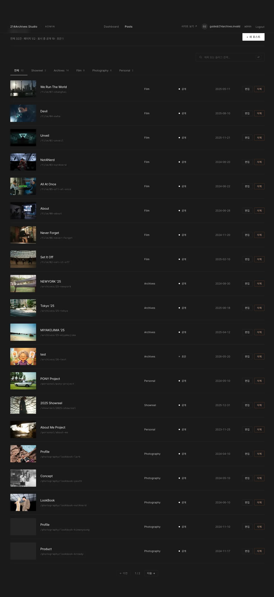

### A. 섹션 탭·검색

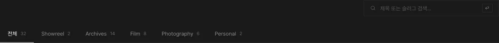

### B. 표

최신 수정순, 20개씩 페이지네이션. 각 행에서 **편집**·**삭제**를 할 수 있습니다.

### C. + 새 포스트

오른쪽 위 **+ 새 포스트**로 새 게시물을 만듭니다. 자세한 절차는 [공통 A — 새 게시물 만들기](../common/0-create) 참고.

## 편집 화면

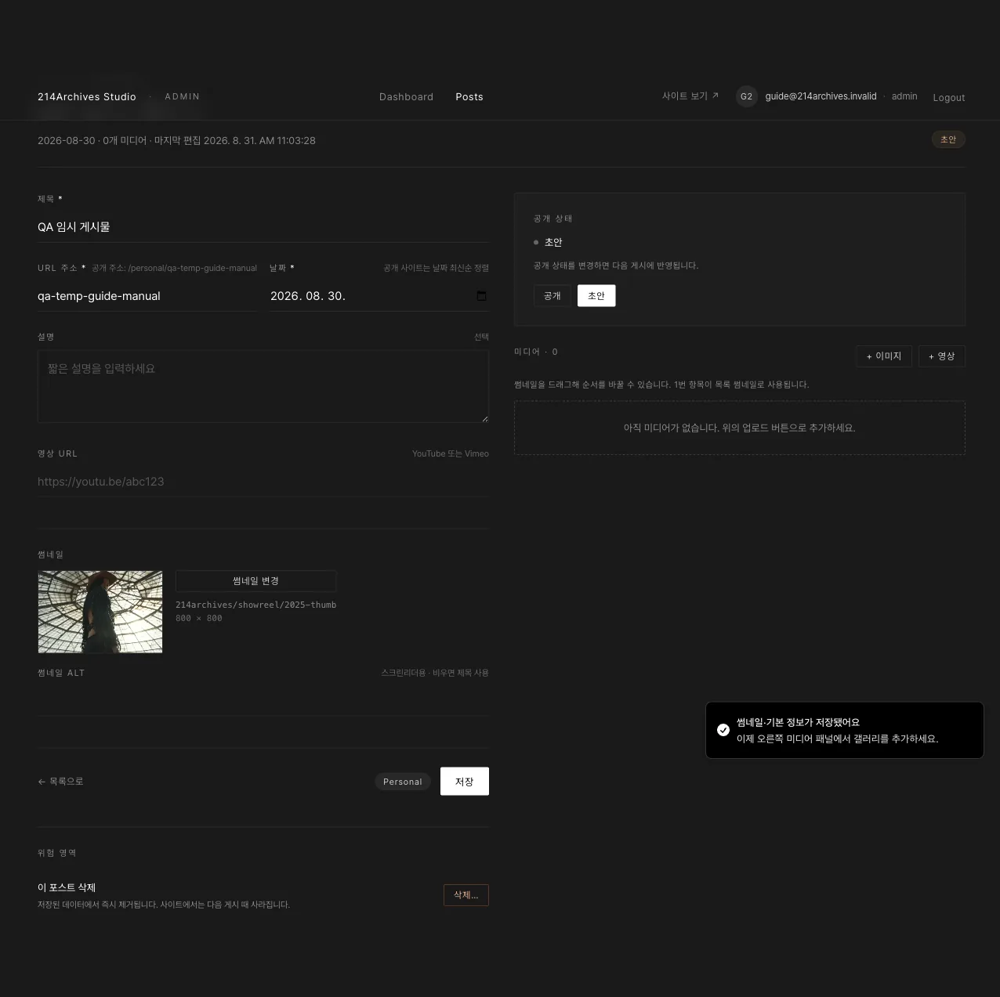

### A. 폼

왼쪽에 **제목** · **슬러그** · **날짜** · 설명(선택) 등 기본 정보를 입력합니다.

### B. 공개 상태

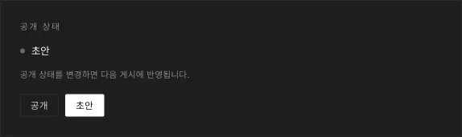

오른쪽 위에 있습니다. 자세히는 [공통 D — 공개 / 초안 바꾸기](../common/3-visibility) 참고.

### C. 미디어

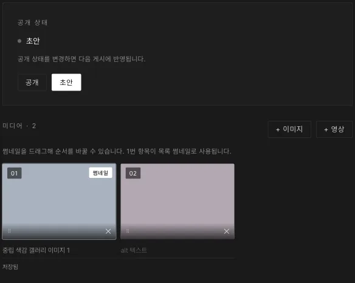

오른쪽에 있습니다. 자세히는 [공통 B — 갤러리 사진 넣기·순서·설명](../common/1-gallery) 참고.

### D. 위험 영역

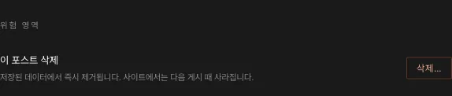

맨 아래에 있습니다. 자세히는 [공통 F — 삭제하기](../common/5-delete) 참고.

## 휴대폰

375px 폭에서도 오버플로 없이 동작하며, 편집 화면에서는 공개 상태·미디어가 폼보다 위에 배치됩니다.

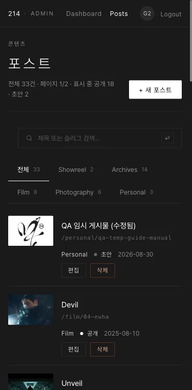

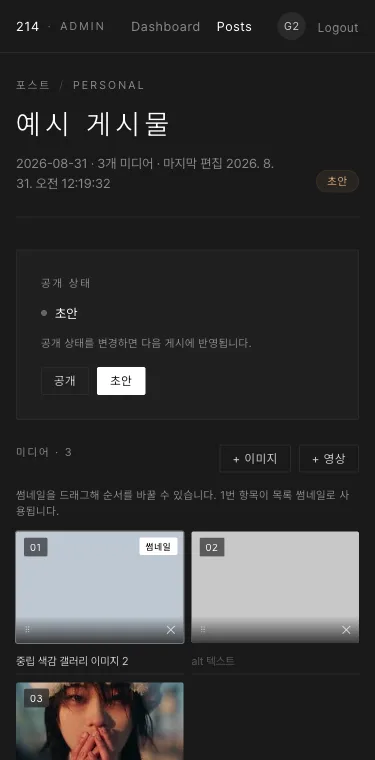
