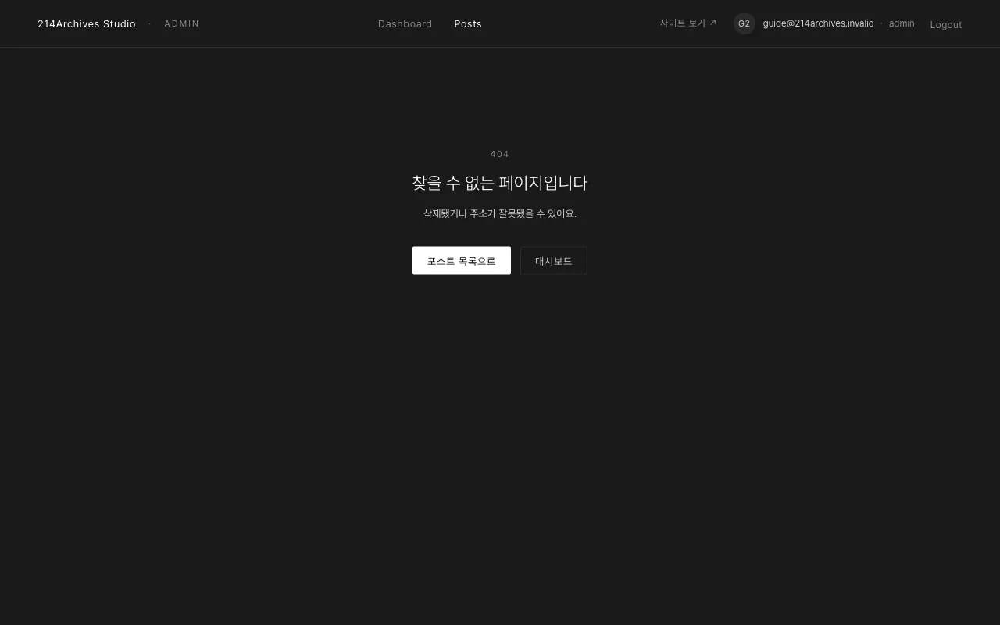

# 주의사항 및 문제 해결

## 하지 말아야 할 것

- "저장 전 새로고침. 탭을 닫거나 새로고침하기 전에 **저장**" — [공통 C — 수정하기](../common/2-edit)
- "위험 영역 → 삭제… → 확인창 **삭제** → 공통 E. 되돌릴 수 없음." — [공통 F — 삭제하기](../common/5-delete)
- "갤러리: **없음** (영상 하나만)" — [Showreel](../category/showreel)
- "Personal 외 섹션에는 "+ 영상" 버튼이 없습니다. Film·Showreel의 영상은 폼의 "영상 URL"로 넣습니다." — [Personal](../category/personal)

## 증상별 해결

| 증상 | 해결 |
|---|---|
| 업로드 위젯이 안 뜸 | 브라우저 팝업 차단 해제 후 재시도 |
| 생성/저장 후 위에 "입력 N곳을 확인해 주세요" | 빨간 밑줄 칸을 채우기. URL 주소는 "이미 사용 중"이면 다른 값으로 |
| 게시했는데 사이트가 그대로 | 1~3분 대기 후 새로고침. 계속 그대로면 대시보드 최근 활동에 `실패`{.error}가 있는지 확인 |
| 게시 패널에 `TIMEOUT`{.error} | 10분 안에 끝나지 않아 자동 실패 처리. 최근 활동 **실행 로그 ↗**로 원인 확인 후 **다시 게시** |
| 최근 활동에 "GitHub 토큰이 만료됐거나 권한이 없습니다" | 관리자에게 토큰 갱신 요청 |
| Film 영상 썸네일 업로드 직후 미리보기가 비어 있음 | 압축본 생성 중. 5~10초 후 자동 재생 |
| 업로더 대신 회색 안내 박스 / 상단에 "업로드 환경 변수가 비어 있어…" | 환경 변수 누락. 관리자에게 요청 (기존 값은 유지됨) |
| 드래그 정렬이 안 됨 | 조금 더 분명히 잡아 끌기. 휴대폰은 **길게 누른 뒤** 이동. 키보드: Tab → Space → 화살표 → Space |
| 새로고침했더니 입력이 사라짐 | 저장 전 새로고침. 탭을 닫거나 새로고침하기 전에 **저장** |
| 로그인 직후 다시 로그인 화면으로 | 계정에 역할이 없음. 관리자에게 등록 요청 |
| 없는 주소로 들어감 ("찾을 수 없는 페이지입니다") | **포스트 목록으로** 버튼으로 복귀 |

## 없는 주소

없는 주소로 들어감 ("찾을 수 없는 페이지입니다") → **포스트 목록으로** 버튼으로 복귀
